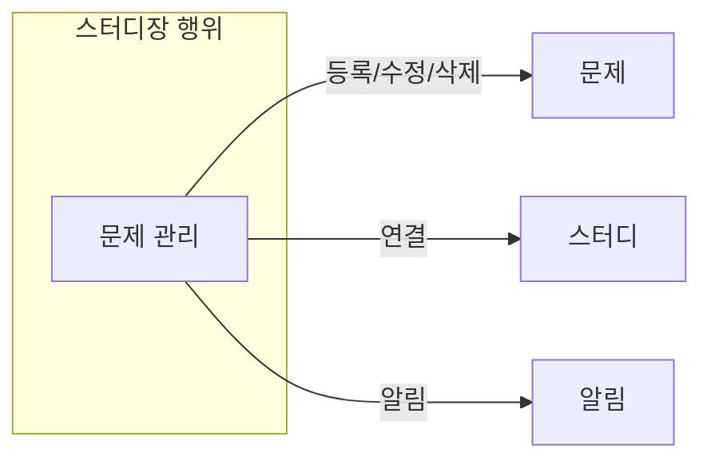

# Guide

본 문서는 코딩테스트 스터디 서비스의 도메인 설계 문서입니다.

## 문제 정의

**코딩테스트 스터디를 진행할 때, 템플릿에 대한 고민**
- 체계적인 문제 풀이 과정 정립의 필요성
- 스터디마다 템플릿을 만들어야 하는 번거로움

**체계적인 기록 관리의 어려움**
- 스터디원별 진도/참여 파악이 어려움
- 코딩테스트 풀이가 분산되어 관리됨

## 목표

**코딩테스트 풀이 템플릿을 제공**
- 리트코드 스타일의 정적 템플릿 제공
  ```
  - Overview(문제 파악)
  - Intuition(직관적 이해)
  - Solution(풀이)
  - Retrospect(회고)
  ```
  통일된 형식으로 효율적인 스터디 진행 지원

**체계적인 기록 관리 지원**
- 진도/참여 현황 시각화
- 풀이 기록의 통합 관리

## 핵심 기능 정의

서비스의 핵심 기능은 스터디와 문제 풀이로 구성됩니다.

### 스터디 (Study)
- 스터디 개설부터 종료까지의 생명주기 관리
- 스터디원 모집 및 관리
- 스터디 일정과 진행률 관리

### 문제 풀이 (Solution)
- 리트코드 스타일의 템플릿 기반 풀이
- 풀이에 대한 피드백과 분석
- 이력 관리 및 알림

상세 내용은 `core.md` 문서를 참고하세요.

## 문서 구조

```
root/
├── README.md                # 도메인 설계 가이드 (현재 문서)
├── core.md                 # 핵심 기능 정의
├── domain/
│   ├── README.md       # 도메인 설계 개요
│   └── ...             # 도메인별 속성/관계/비즈니스 규칙/책임 등
│
├── roles/              # 역할 정의 및 행위
│   ├── README.md       # 역할 설계 개요
│   ├── user.md         # 기본 유저 역할 정의/행위
│   ├── leader.md       # 스터디장 역할 정의/행위
│   └── member.md       # 스터디원 역할 정의/행위
│
└── api/
    └── README.md          # API 문서 개요
```

## 개발 단계별 문서 작성

**1. 도메인 분석 단계(초기 개발)**
- 역할 및 상황 파악
- 역할별 기능 정의
- 도메인 모델 설계 및 행위 분석

**2. 도메인 설계 단계 (초기 개발)**
- 도메인 추출
- 도메인별 기능 정의
- 도메인 간의 의존관계 파악
- 도메인 모델 구조화

**3. API 설계 단계 (초기 개발)**
- RESTful API 지향
- 리소스와 엔드포인트 정의
- 요청/응답 구조 설계
- API 명세서 작성

**4. 기능 추가 단계 (추가 개발)**
1. API 변경사항 검토
  - API 문서 수정 사항 정리
2. 도메인 영향도 체크
  ```markdown
  ## PR 체크리스트
  - [ ] API 문서 수정 사항
  - [ ] 도메인 모델 영향도 검토
  - [ ] (필요시) 도메인 모델 수정
  ```

## 다이어그램 작성

### 기본 원칙
- Mermaid를 사용하여 다이어그램 작성
- 각 문서의 특성에 맞는 다이어그램 표현

### 역할 문서의 다이어그램
- 행위 중심의 flowchart
- 해당 역할의 행위를 통한 도메인 도출
- 행위 수행 시 필요한 도메인들의 흐름 표현

예시: 스터디장의 행위와 도메인


### 도메인 문서의 다이어그램
1. 상태 다이어그램 (stateDiagram)
   - 도메인의 상태 변화 표현
   - 각 상태에서 가능한 행위 표현
   - 예시: 문제의 상태 변화
    ```mermaid
    stateDiagram-v2
    direction LR
    [*] --> 등록됨: 문제 등록
    등록됨 --> 공개됨: 공개 설정
    공개됨 --> 마감됨: 제출 마감
    ```

2. 시퀀스 다이어그램 (sequenceDiagram)
   - 도메인 간의 상호작용 순서 표현
   - 이벤트와 데이터 흐름 표현
   - 예시: 문제 등록 프로세스
    ```mermaid
    sequenceDiagram
    actor Leader as 스터디장
    participant Problem as 문제
    participant Study as 스터디
    participant Notice as 알림
    participant Member as 스터디원
    
    Leader->>+Problem: 문제 등록 요청
    Problem-->>-Leader: 등록 완료
    
    Problem->>+Study: 스터디에 문제 연결
    Study-->>-Problem: 연결 완료
    
    Study->>+Notice: 새 문제 알림 생성
    Notice-->>-Study: 알림 생성 완료
    
    Notice->>+Member: 스터디원들에게 알림 전송
    Member-->>-Notice: 알림 수신 확인
    ```
