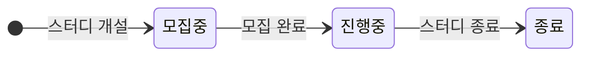
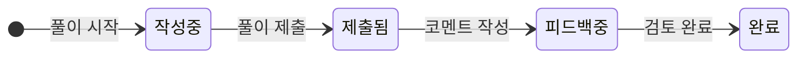

# 핵심 기능 설계

## 스터디(Study)

### 상태

### 주요 기능

- 스터디 관리
  - 기본 정보 관리 (제목, 설명, 기간, 인원)
  - 스터디원 모집/관리
  - 진행 상태 관리

- 일정 관리
  - 스터디 일정 등록

- 진행률 관리
  - 문제 풀이 완료율 계산
  - 진행 상태 조회

## 문제 풀이(Solution)

### 상태

### 주요 기능

- 풀이 관리
  - 템플릿 기반 풀이 작성
  - 풀이 이력 관리
  - 피드백 작성/관리

- 분석 관리
  - 알고리즘 분류
  - 난이도 평가
  - 풀이 방법 태깅
