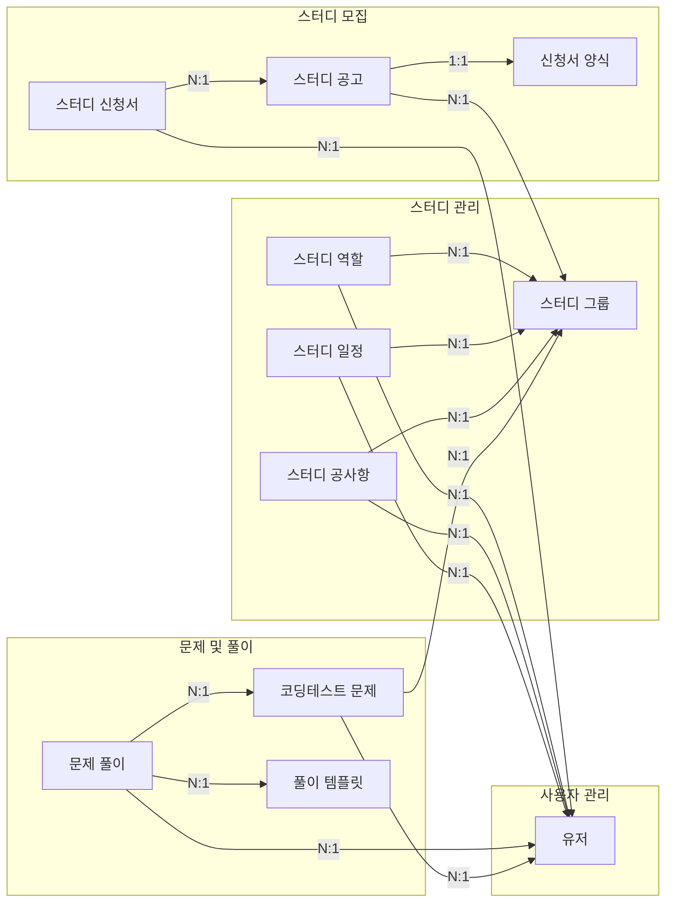
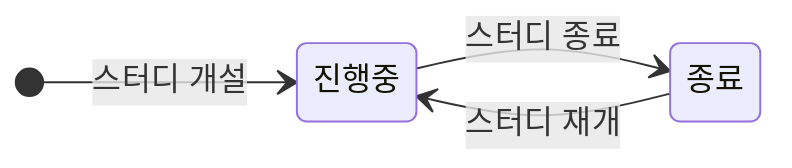
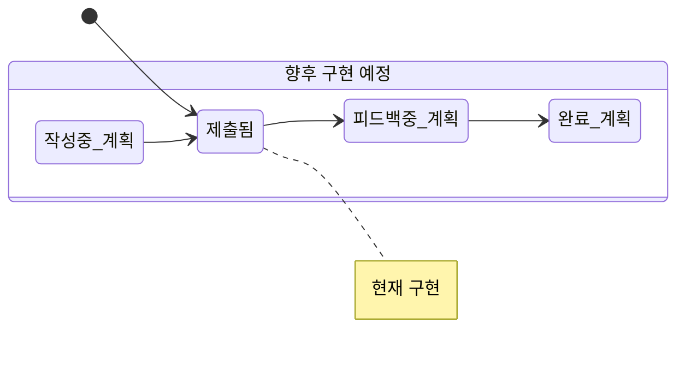

# 도메인 설계 개요
이 문서는 코딩테스트 스터디 서비스의 도메인 설계에 대한 전체적인 개요를 제공합니다. 각 도메인의 목적, 관계를 이해하고 전체 시스템의 맥락을 파악하는 데 도움이 됩니다.

## 도메인 모델 구조
코딩테스트 스터디 서비스는 다음과 같은 핵심 도메인으로 구성됩니다:



## 핵심 용어 정의

| 용어 | 정의 |
|:---|:---|
| User(유저) | 정보를 등록한 사용자 |
| StudyGroup(스터디그룹) | 코딩테스트 학습을 위한 그룹, 활동 단위 |
| StudyMembership(스터디 역할) | 사용자와 스터디 간의 관계 및 역할(스터디장/스터디원) 정보 |
| StudySchedule(일정) | 스터디 모임 시간(정기, 일회성) 및 장소 정보 |
| StudyNotice(공지사항)| 스터디 내 전달 사항 |
| Solution(풀이) | 문제에 대한 스터디원의 해결 과정 및 풀이 설명 |
| Template(템플릿) | 구조화된 문제 풀이 형식 |
| Problem(코딩테스트 문제)| 풀이의 기준이 되는 코딩테스트 문제 링크 정보 |
| StudyAnnouncement(공고) | 스터디원을 모집하는 정보 |
| StudyApplication(신청서) | 공고에 지원 내용, 스터디 참여 신청을 위한 정보 |
| ApplicationForm(신청서 양식) | 신청서를 이루고 있는 양식 |

## 주요 도메인 목록

| 도메인 | 설명 | 문서 위치 |
|:---|:---|:---|
| User | 서비스 사용자 계정 관련 정보 | [user.md](./user.md) |
| StudyGroup | 스터디의 기본 정보와 상태 관리 | [study.md](./study.md) |
| StudyMembership | 사용자와 스터디 간의 관계 및 역할 관리 | [study.md](./study.md) |
| StudySchedule | 스터디 일정 관리 | [study.md](./study.md) |
| StudyNotice | 스터디 공지사항 관리| [study.md](./study.md) |
| Problem | 코딩테스트 문제 관리 | [study.md](./study.md) |
| StudyAnnouncement | 스터디 모집 공고 관리 | [application.md](./application.md) |
| ApplicationForm | 스터디 지원 양식 관리 | [application.md](./application.md) |
| StudyApplication | 스터디 지원서 관리 | [application.md](./application.md) |
| Solution | 문제 풀이 관리 | [solution.md](./solution.md) |
| Template | 풀이 템플릿 관리 | [solution.md](./solution.md) |

## 핵심 생명주기 개요

### 스터디 생명주기


### 문제 풀이 생명주기



## 핵심 사용자 시나리오

1. **스터디 생성 및 모집:** 사용자가 스터디 생성 → 모집 공고 작성 → 신청서 검토 → 스터디원 승인
2. **문제 풀이 제출:** 스터디장 문제 등록 → 스터디원 풀이 작성 → 템플릿 기반 제출 → 피드백 교환
3. **풀이 기록 관리:** 풀이 제출 → 풀이 분석/태깅 → 통계 생성 → 학습 패턴 분석

## 주요 설계 결정 및 근거

- **템플릿 기반 풀이 구조화**
    - 이유: 초기에는 리트코드 스타일의 정적 템플릿 제공으로 시작하되, 추후 노션처럼 다양한 유형의 풀이를 작성할 수 있는 기반 마련
    - 효과: 일관된 풀이 형식 보장, 구조화된 데이터로 풀이 분석 가능, 유연한 확장성 확보

- **스터디멤버십-사용자 분리**
    - 이유: 사용자가 여러 스터디에서 다양한 역할을 수행할 수 있는 유연성 확보
    - 효과: 사용자의 스터디별 역할 관리 용이, 스터디 간 독립성 유지

- **문제와 풀이의 명확한 분리**
    - 이유: 하나의 문제에 여러 풀이가 존재할 수 있으며, 풀이 기록을 독립적으로 관리할 필요
    - 효과: 문제별 다양한 접근법 비교 가능, 풀이 이력 관리와 분석 용이

- **문제 풀이 생명주기 설계**
    - 이유: 미완성된 상태로 여러 번에 나누어 작성할 수 있고, 피드백과 완료 상태를 두어 깃허브 Pull Request처럼 다른 사람의 리뷰를 장려
    - 효과: 협업 기반 학습 강화, 코드 리뷰 문화 정착, 지속적인 풀이 개선 가능

- **모집 프로세스와 스터디 진행 분리**
    - 이유: 모집과 진행은 서로 다른 생명주기와 관련 도메인을 가짐
    - 효과: 모집 완료 후에도 지원서/공고 정보 보존, 각 단계별 독립적 관리 가능, 스터디 진행 중에도 모집 가능

- **일정 관리 유연성 확보**
    - 이유: 정기 일정과 일회성 일정을 모두 지원하여 다양한 일정 관리
    - 효과: 스터디 유형에 따른 맞춤형 일정 관리 지원

## 향후 확장 고려사항

현재 구현 계획에는 없지만 미래에 확장 가능한 도메인 요소들입니다:

### SolutionFeedback(풀이 피드백) 도메인

- **정의**: 문제 풀이에 대한 간단한 의견, 조언 또는 질문 등의 피드백
- **목적**: 풀이에 대한 동료 학습자 및 스터디장의 피드백을 통해 풀이 개선 및 학습 효과 향상
- **예상 관계**:
  ```mermaid
  flowchart LR
      SolutionFeedback -->|N:1| Solution
      SolutionFeedback -->|N:1| User
  ```
- **효과**
    - 풀이 과정에서의 의사소통 활성화
    - 상호 학습 촉진
    - 풀이 품질 향상

## 도메인 문서 구성
각 도메인 문서는 다음 구조로 구성됩니다:
- 도메인 정의 및 책임
- 속성 및 관계
- 상태 다이어그램 (해당하는 경우)
- 주요 메서드 및 기능
- 연관 도메인과의 관계

## 확장 및 유지보수 가이드
새로운 기능이나 도메인을 추가할 때는 다음 절차를 따릅니다:
1. 기존 도메인과의 관계 분석
2. 새로운 도메인의 책임과 경계 정의
3. 도메인 문서 작성 및 README.md 업데이트
4. 상태 다이어그램과 의존 관계 갱신
