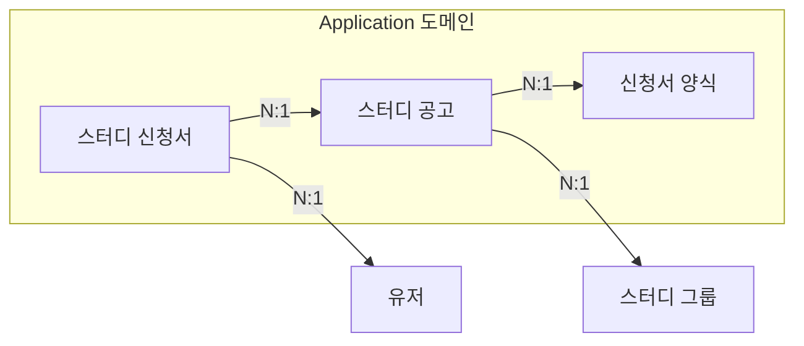
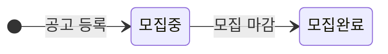
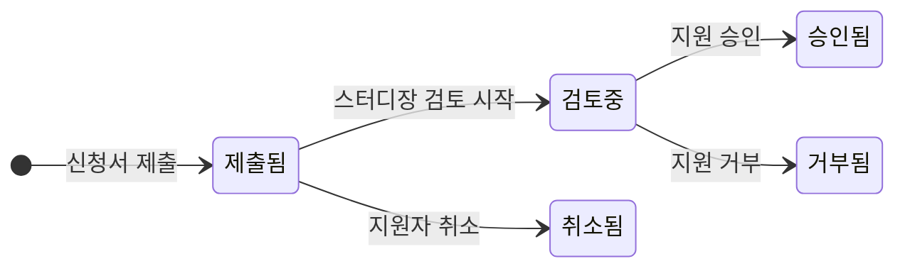
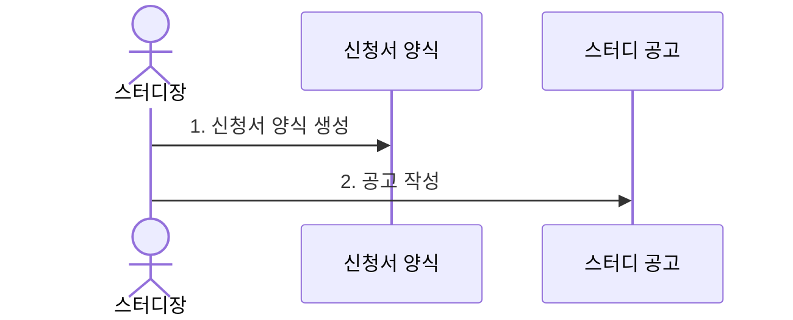
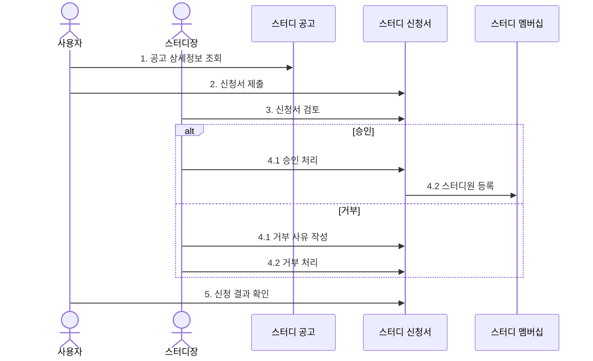

# Application 도메인 문서

Application(지원) 도메인은 스터디 모집과 지원 프로세스를 관리하는 영역으로, 스터디 공고부터 지원서 제출 및 검토까지의 전체 과정을 담당합니다. 

## 도메인 구성요소

Application 도메인은 다음과 같은 세부 도메인으로 구성됩니다:

## StudyAnnouncement (스터디 공고)

### 정의
StudyAnnouncement는 스터디 모집을 위한 공개 공고를 나타내는 도메인입니다. 

### 상태

### 주요 속성

| 속성 | 타입 | 설명 |
|:---|:---|:---|
| id | String | 공고 고유 식별자 |
| studyGroupId | String | 연결된 스터디 그룹 ID |
| applicationFormId | String | 연결된 신청서 양식 ID |
| title | String | 공고 제목 |
| description | String | 상세 설명 |
| recruitCapacity | Integer | 모집 인원 |
| startDate | LocalDateTime | 모집 시작일 |
| endDate | LocalDateTime | 모집 마감일 |
| status | Enum | 공고 상태 (모집중/모집완료) |
| createdAt | LocalDateTime | 작성일시 |

### 주요 메서드 및 기능

- `createAnnouncement()`: 새로운 스터디 공고 등록
- `updateAnnouncement()`: 공고 정보 수정
- `closeAnnouncement()`: 모집 마감 처리
- `deleteAnnouncement()`: 공고 삭제 (처리되지 않은 지원자가 없는 경우에만 가능)
- `getAnnouncementsByCondition()`: 조건별 공고 검색
- `getApplicationsForAnnouncement()`: 공고에 접수된 신청서 목록 조회

### 비즈니스 규칙

- 공고는 스터디장만 작성할 수 있음
- 최소 모집 인원은 1명 이상이어야 함
- 모집 마감일은 시작일보다 이후여야 함
- 공고 삭제는 처리되지 않은(수락 또는 거절되지 않은) 지원자가 없는 경우에만 가능
- 공고 수정은 모집중 상태일 때만 가능
- 이미 모집이 완료된 공고는 재오픈할 수 없음

### 참고사항

- 공고는 스터디 그룹과 N:1 관계를 가집니다. 하나의 스터디 그룹에는 여러 공고가 존재할 수 있습니다.
- 공고는 신청서 양식과 N:1 관계를 가집니다. 하나의 신청서 양식은 여러 공고에서 재사용될 수 있습니다.
- 하나의 스터디 그룹에는 여러 개의 공고가 연결될 수 있으나, 동시에 모집중인 공고는 하나만 존재할 수 있습니다.
- 스터디 그룹은 '모집중' 상태뿐만 아니라 '진행중' 상태에서도 새로운 공고를 등록할 수 있습니다.
- 스터디 그룹 상태가 '종료'로 변경되면 모든 모집중 공고는 자동으로 '모집완료' 상태로 변경됩니다.
- 처리되지 않은 지원자가 있는 공고는 삭제할 수 없으며, 모든 지원서를 처리(승인 또는 거절)한 후에야 삭제가 가능합니다.
- 구현 단계에서는 데이터 보존을 위해 실제 삭제가 아닌 소프트 딜리트 방식으로 처리할 수 있습니다. 이는 도메인 설계가 아닌 구현 세부사항으로 간주합니다.
- 이미 승인된 지원자가 있는 경우에도 공고를 삭제할 수 있으나, 승인된 스터디원의 멤버십은 유지됩니다.

## ApplicationForm (신청서 양식)

### 정의
ApplicationForm은 스터디 지원자가 공고 지원 시, 작성해야 하는 신청서의 양식을 정의하는 도메인입니다. 지원자로부터 수집하고자 하는 정보의 구조를 정의합니다.

### 주요 속성

| 속성 | 타입 | 설명 |
|:---|:---|:---|
| id | String | 양식 고유 식별자 |
| studyGroupId | String | 연결된 스터디 그룹 ID |
| title | String | 양식 제목 |
| content | String | 양식 내용 |

### 주요 메서드 및 기능

- `createForm()`: 신청서 양식 생성
- `updateForm()`: 양식 수정
- `deleteForm()`: 양식 삭제 (참조하는 공고가 없는 경우만 가능)
- `getFormById()`: 양식 ID로 조회
- `getFormsByStudyGroup()`: 스터디 그룹으로 양식 목록 조회

### 비즈니스 규칙

- 양식은 스터디 그룹에 소속되며, 해당 스터디 그룹의 스터디장만 수정/삭제 가능
- 사용 중인 양식(공고에서 참조 중인 양식)은 삭제할 수 없음

### 참고사항

- 신청서 양식은 공고와 별도로 생성되며, 공고 생성 시에 기존 양식을 선택하거나 새로 생성할 수 있습니다.
- 양식은 스터디 그룹에 소속되며, 그룹 내 여러 공고에 재사용될 수 있습니다.
- 양식 변경은 신청서 제출 후에도 가능하나, 이미 제출된 신청서에는 영향을 주지 않습니다.
- 스터디장 권한이 이전되면 양식에 대한 권한도 함께 이전됩니다.
- 양식 삭제는 참조하는 공고가 없는 경우에만 가능합니다.
- 현재 버전에서는 양식 내용을 단순 String으로 관리하며, 향후 필요시 구조화된 필드 형태로 확장 가능합니다.(JSON 형식, Markdown, Key-Value 형태 등)

## StudyApplication (스터디 신청서)

### 정의
StudyApplication은 사용자가 특정 스터디에 지원하기 위해 제출한 신청서를 나타내는 도메인입니다.

### 상태

### 주요 속성

| 속성 | 타입 | 설명 |
|:---|:---|:---|
| id | String | 신청서 고유 식별자 |
| announcementId | String | 연결된 공고 ID |
| applicantId | String | 지원자 ID |
| content | String | 신청서 내용 |
| status | Enum | 상태 (제출됨/검토중/승인됨/거부됨/취소됨) |
| rejectionReason | String | 거부 사유 (거부된 경우) |
| submittedAt | LocalDateTime | 제출일시 |
| updatedAt | LocalDateTime | 수정일시 |
| reviewedAt | LocalDateTime | 검토일시 |
| reviewedBy | User | 검토자 (스터디장) |

### 주요 메서드 및 기능

- `submitApplication()`: 신청서 제출
- `updateApplication()`: 신청서 내용 수정 (제출됨 상태일 때만 가능)
- `startReview()`: 검토 시작 표시
- `approveApplication()`: 신청서 승인
- `rejectApplication()`: 신청서 거부
- `cancelApplication()`: 신청서 취소 (지원자)
- `getApplicationsByAnnouncement()`: 공고별 신청서 목록 조회
- `getApplicationsByApplicant()`: 지원자별 신청서 목록 조회 (자신의 신청서 조회 포함)
- `getApplicationDetail()`: 신청서 상세 정보 조회

### 비즈니스 규칙

- 사용자는 하나의 공고에 대해 하나의 신청서만 제출 가능
- 이미 승인된 신청서는 취소할 수 없음
- 공고 마감 후에는 신청서 제출 불가
- 승인된 신청서의 지원자는 자동으로 스터디원으로 등록됨
- 스터디 모집 인원이 다 찬 경우, 추가 신청서 승인 불가

### 참고사항

- 신청서 취소는 지원자 본인만 가능하며, 검토중이거나 승인/거부된 신청서는 취소할 수 없습니다.
- 거부 사유는 선택 사항이나, 지원자에게 피드백을 제공하기 위해 작성을 권장합니다.
- 신청서 승인 시 StudyMembership 도메인과 연계하여 자동으로 스터디원 권한이 부여됩니다.

## 스터디 신청 및 등록 과정

### 스터디 모집 등록 과정

### 신청서 처리 과정

## ApplicationForm 확장성 고려사항

현재 ApplicationForm은 content 필드를 String으로 관리하고 있으나, 향후 확장성을 고려하여 구조화된 형태로 발전시킬 수 있습니다.

### 구조화 방향성
- 신청서 양식을 구조화된 데이터 형식(예: JSON)으로 저장하여 다양한 질문 유형과 검증 규칙을 지원할 수 있습니다.
- 이를 통해 신청서가 유효한지 사전에 검사할 수 있으며, 신청서 작성 과정에서 실시간 유효성 검증이 가능해집니다.
- 구체적인 구조화 방식과 필드 유형은 추후 요구사항에 따라 결정할 예정입니다.

### 구조화의 이점
- 유연성: 다양한 유형의 질문을 구성할 수 있습니다.
- 검증 용이성: 각 필드별로 유효성 검사 규칙을 적용할 수 있습니다.
- 데이터 분석: 구조화된 데이터는 응답 분석 및 통계 처리가 용이합니다.
- UI 렌더링: 프론트엔드에서 동적으로 폼을 생성하고 렌더링하기 쉽습니다.
