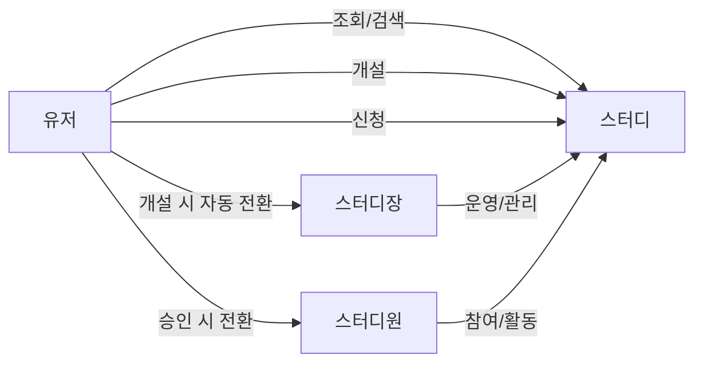

# 역할 설계 개요

## 역할 정의

스터디 서비스에서는 세 가지 주요 역할이 존재합니다

### 유저(User)

- 스터디 서비스의 기본 사용자
- 스터디 조회, 검색, 신청, 개설이 가능
- 스터디장이나 스터디원이 되기 전의 상태

### 스터디장(Leader)

- 스터디를 개설한 사용자
- 스터디를 운영하는 역할
- 스터디원 모집 및 관리 권한 보유
- 한 스터디 내에서 한 명만 존재

### 스터디원(Member)

- 스터디에 참여하여 활동하는 역할
- 코딩테스트 풀이 제출, 코멘트 작성 등 활동
- 한 스터디에 여러 명 존재 가능

## 역할 간 관계

- 유저 → 스터디장: 스터디 개설을 통해 전환
- 유저 → 스터디원: 스터디 신청 및 승인을 통해 전환
- 한 사용자가 여러 스터디에서 다른 역할 가능 (스터디A의 스터디장이면서 스터디B의 스터디원)

## 핵심 제약사항

- 스터디 개설시 자동으로 해당 스터디의 스터디장이 됨
- 한 스터디는 하나의 스터디장만 가질 수 있음
- 한 사용자는 여러 스터디의 스터디장이 될 수 있음
- 스터디장도 다른 스터디의 스터디원이 될 수 있음

## 역할별 권한 범위

