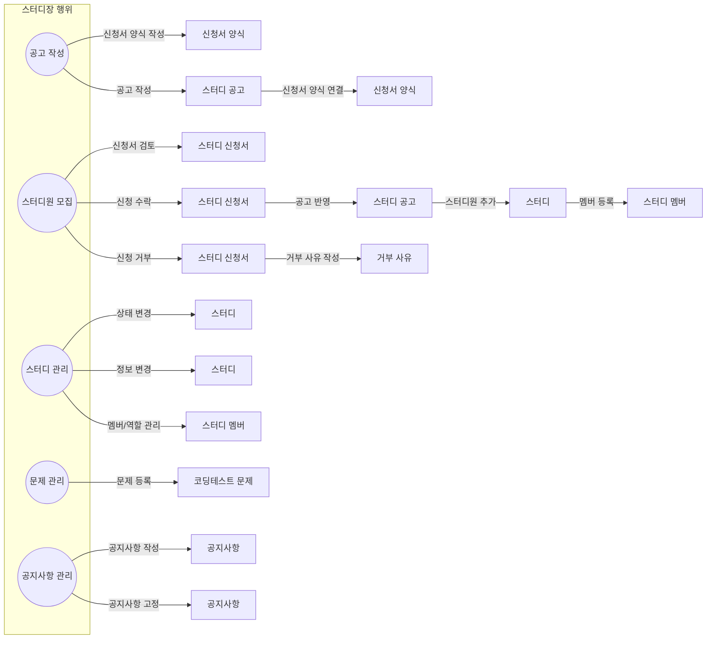
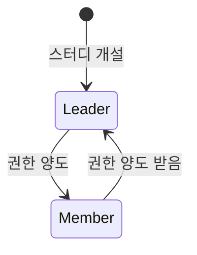

# 스터디장 역할

스터디장은 스터디를 개설하고 운영하는 역할입니다. 스터디의 관리와 운영에 대한 권한을 보유하고 있습니다.

## 행위 및 도메인

## 도메인별 기능

- 신청서 양식 (ApplicationForm)
    - 양식 작성

- 스터디 공고 (StudyAnnouncement)
    - 공고 작성
    - 신청서 양식과 연결

- 스터디 신청서 (Application)
    - 신청서 검토
    - 신청 수락
    - 신청 거부

- 스터디 (Study)
    - 기본 정보 관리
    - 진행 상태 관리

- 스터디 멤버 (StudyMembership)
    - 멤버 등록/삭제
    - 역할 관리

- 코딩테스트 문제 (Problems)
    - 문제 등록/수정/삭제
    - 제출 현황 관리

- 공지사항 (Notice)
    - 공지사항 작성/수정/삭제
    - 공지사항 고정/해제

## 권한 및 제한사항

- 스터디당 한 명의 스터디장만 존재 가능
- 스터디장은 모든 관리 기능에 대한 접근 권한 보유
- 스터디 개설자가 스터디장이 됨
- 스터디장은 탈퇴 불가 (스터디 상태와 무관)
    - 단, 다른 스터디원에게 권한 양도 후 탈퇴 가능
- 스터디장은 다른 스터디원에게 스터디장 권한 양도 가능
    - 양도 시 이전 스터디장은 스터디원이 됨
    - 새로운 스터디장은 모든 스터디장 권한을 승계

## 역할 상태

