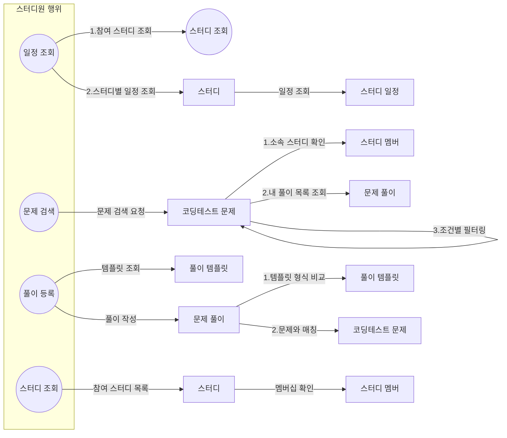
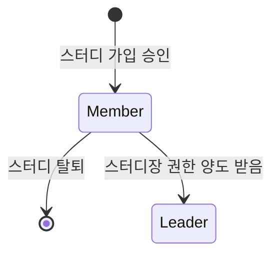

# 스터디원(Member) 역할

스터디원은 스터디에 참여한 유저로, 코딩테스트 문제를 풀고 다른 스터디원들과 상호작용하는 역할입니다.

## 행위 및 도메인

## 도메인별 기능

- 스터디 (Study)
  - 스터디원 관점에서는 별도 기능 없음
  - 다른 도메인과의 연관 관계를 위한 도메인으로 사용

- 스터디 멤버 (StudyMembership)
  - 소속 스터디 확인

- 스터디 일정 (Schedule)
  - 일정 조회

- 코딩테스트 문제 (Problem)
  - 문제-풀이 매칭 검증

- 풀이 템플릿 (Template)
  - 템플릿 조회
  - 템플릿 형식 검증

- 문제 풀이 (Solution)
  - 풀이 작성
  - 풀이 목록 조회

## 권한 및 제한사항
- 동시에 여러 스터디의 스터디원이 될 수 있음
- 스터디 진행 중에는 자유롭게 탈퇴 가능
- 본인이 등록한 풀이에 대해서만 수정/삭제 권한 보유

## 역할 상태

## 참고사항

멤버별 진행 상황, 스터디 전체 진행 상황과 같은 통계성 기능들은 도메인 모델링 단계에서 제외했습니다. 이러한 기능들은 `Problem`과 `Solution` 도메인의 데이터를 활용한 서비스 레벨의 기능으로 구현할 예정입니다.