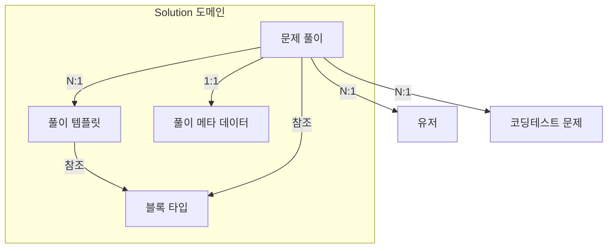
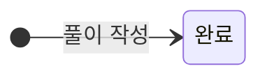
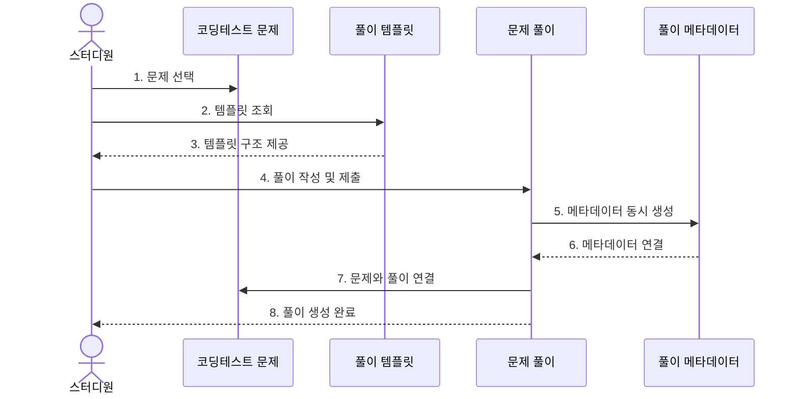
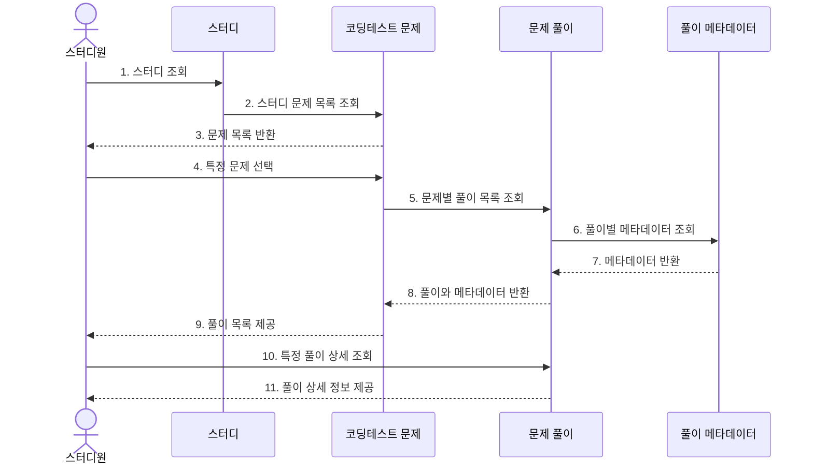
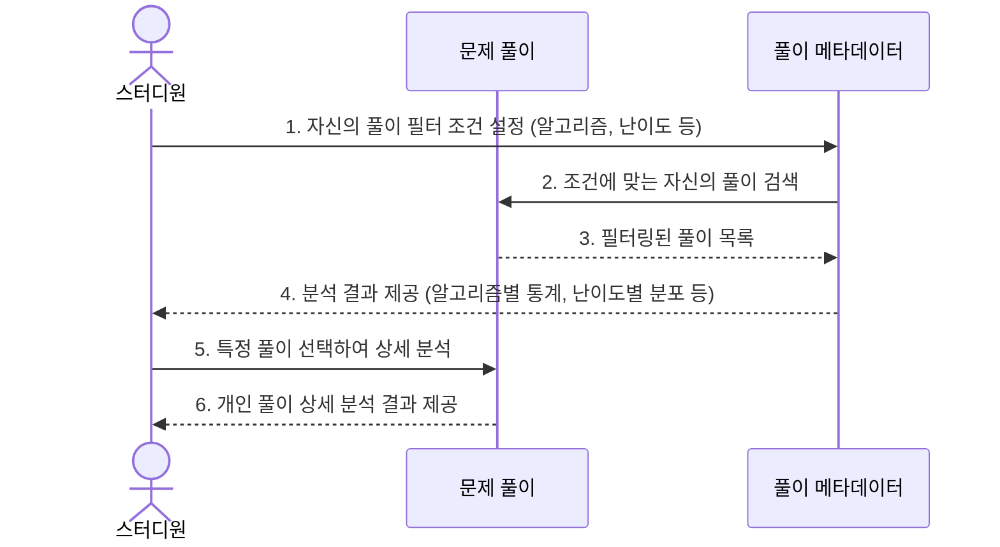
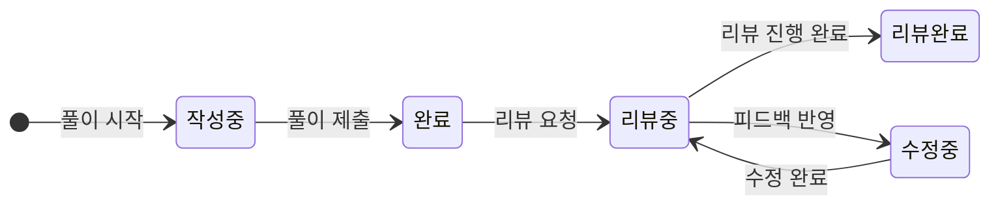

# Solution(문제 풀이) 도메인 문서

Solution(문제 풀이) 도메인은 코딩테스트 문제에 대한 풀이를 관리하는 영역입니다.

## 도메인 구성요소

Solution 도메인은 다음과 같은 세부 도메인으로 구성됩니다:



## Template(풀이 템플릿)

### 정의
Template은 문제 풀이의 구조를 정의하는 도메인으로, 체계적이고 일관된 풀이 형식을 제공합니다.

### 주요 속성

| 속성 | 타입 | 설명 |
|:---|:---|:---|
| id | String | 템플릿 고유 식별자 |
| name | String | 템플릿 이름 |
| description | String | 템플릿 설명 |
| structure | JSON | 템플릿의 재귀적 구조 정의 (필수 블록, 블록 계층 구조 및 속성 등) |
| createdBy | User | 생성자 |

### 템플릿 structure JSON 구조

템플릿 structure 다음과 같은 형태의 JSON으로 정의됩니다:

```json
{
  "structure": [
    {
      "id": "overview",
      "defaultTitle": "문제 파악",
      "description": "문제의 입/출력과 요구사항을 파악합니다.",
      "required": true,
      "blockType": "text",
      "blocks": [
        {
          "id": "input-output",
          "defaultTitle": "입/출력 형태와 제약 조건",
          "description": "입력과 출력 형태, 문제의 제약사항을 정리합니다.",
          "required": true,
          "blockType": "text"
        },
        {
          "id": "requirements",
          "defaultTitle": "문제의 요구사항",
          "description": "문제가 요구하는 내용을 분석합니다.",
          "required": true,
          "blockType": "text"
        }
      ]
    },
    {
      "id": "intuition",
      "defaultTitle": "직관적 이해",
      "description": "문제 접근법을 탐색합니다.",
      "required": true,
      "blockType": "text",
      "blocks": [
        {
          "id": "example-analysis",
          "defaultTitle": "예제 분석",
          "description": "주어진 예제를 분석합니다.",
          "required": true,
          "blockType": "text"
        },
        {
          "id": "pattern-identification",
          "defaultTitle": "문제의 본질과 패턴",
          "description": "문제에서 발견할 수 있는 패턴을 파악합니다.",
          "required": true,
          "blockType": "text"
        },
        {
          "id": "edge-cases",
          "defaultTitle": "Edge case 고려",
          "description": "특수 케이스와 예외 상황을 고려합니다.",
          "required": false,
          "blockType": "text"
        }
      ]
    },
    {
      "id": "solution",
      "defaultTitle": "풀이",
      "description": "문제 해결을 위한 코드 작성",
      "required": true,
      "blockType": "text",
      "multipleAllowed": true,
      "blocks": [
        {
          "id": "implementation-steps",
          "defaultTitle": "구현 스텝",
          "description": "해결책 구현 과정을 단계별로 설명합니다.",
          "required": true,
          "blockType": "text"
        },
        {
          "id": "complexity",
          "defaultTitle": "복잡도 분석",
          "description": "시간 복잡도와 공간 복잡도를 분석합니다.",
          "required": true,
          "blockType": "text",
          "blocks": [
            {
              "id": "time-complexity",
              "defaultTitle": "시간 복잡도",
              "blockType": "math",
              "required": true
            },
            {
              "id": "time-explanation",
              "defaultTitle": "시간 복잡도 설명",
              "blockType": "text",
              "required": false
            },
            {
              "id": "space-complexity",
              "defaultTitle": "공간 복잡도",
              "blockType": "math",
              "required": true
            },
            {
              "id": "space-explanation",
              "defaultTitle": "공간 복잡도 설명",
              "blockType": "text",
              "required": false
            }
          ]
        },
        {
          "id": "code",
          "defaultTitle": "구현 코드",
          "description": "실제 구현 코드를 작성합니다.",
          "required": true,
          "blockType": "code"
        },
        {
          "id": "submission-result",
          "defaultTitle": "제출 결과",
          "description": "제출 후 실행 시간, 메모리 사용량 등을 기록합니다.",
          "required": false,
          "blockType": "text"
        }
      ]
    },
    {
      "id": "retrospect",
      "defaultTitle": "회고",
      "description": "풀이 과정 돌아보기",
      "required": true,
      "blockType": "text",
      "blocks": [
        {
          "id": "strengths",
          "defaultTitle": "잘된 점",
          "description": "풀이 과정에서 잘 수행한 부분을 기록합니다.",
          "required": false,
          "blockType": "text"
        },
        {
          "id": "lessons",
          "defaultTitle": "배운 점",
          "description": "문제를 통해 배운 내용을 정리합니다.",
          "required": true,
          "blockType": "text"
        },
        {
          "id": "improvements",
          "defaultTitle": "개선할 점",
          "description": "향후 개선하거나 다르게 접근할 수 있는 방법을 고려합니다.",
          "required": false,
          "blockType": "text"
        }
      ]
    }
  ]
}
```


### 주요 메서드 및 기능

- `getDefaultTemplate()`: 기본 템플릿 조회

### 비즈니스 규칙

- 시스템은 기본 템플릿을 제공함 (리트코드 스타일)
- 템플릿 구조는 재귀적 구조를 가진 JSON 형태로 정의되며, 필수 섹션과 선택 섹션으로 구성됨
- 기본 템플릿은 수정/삭제 불가

### 참고사항

- 템플릿은 "무엇을 어디에 작성해야 하는지"의 구조를 제공하지만, "그 안에 무슨 내용을 넣을지"는 제한하지 않습니다
- 초기 버전에서는 리트코드 스타일의 정적 템플릿만 제공합니다
- 템플릿 structure는 재귀적 구조를 가지며, 각 블록은 하위 블록을 포함할 수 있습니다
- multipleAllowed 속성이 true인 블록(예: 풀이)은 여러 개 작성할 수 있습니다
- 각 블록은 Block 도메인에서 정의된 blockType을 참조합니다
- 향후 버전에서는 사용자별 커스텀 템플릿 생성 기능을 지원할 계획입니다

## Block(블록)

### 정의
Block은 콘텐츠 블록의 유형과 표시 방식을 정의하는 도메인입니다. 템플릿과 솔루션에서 다양한 타입의 콘텐츠를 일관되게 표현하기 위한 기준을 제공합니다.

### 주요 속성

| 속성 | 타입 | 설명 |
|:---|:---|:---|
| type | String | 블록 타입 식별자 (text, code, math 등) |
| description | String | 블록 타입 설명 |
| options | JSON | 블록 타입별 설정 옵션 (필수/선택 속성, 지원 값 등) |

**타입(type)**

| 타입 | 설명 | 에디터 UI |
|:---|:---|:---|
| text | 일반 텍스트 (Markdown 지원) | 마크다운 에디터 |
| code | 코드 블록(구문 강조 지원) | 코드 에디터(언어 선택 드롭다운 포함) |
| math | 수학 수식(LaTeX 형식) | LaTeX 에디터 |

### 블록 타입 예시

**텍스트 블록**

```json
{
  "type": "text",
  "description": "일반 텍스트 블록 (마크다운 지원)",
  "options": {}
}
```

**코드 블록**

```json
{
  "type": "code",
  "description": "프로그래밍 코드 블록 (구문 강조 지원)",
  "options": {
    "properties": [
      {
        "name": "language",
        "description": "프로그래밍 언어",
        "type": "select",
        "defaultValue": "python",
        "allowedValues": ["python", "java", "javascript", "c++", "typescript", "go", "ruby", "other"]
      }
    ]
  }
}
```

**수학 수식 블록**

```json
{
  "type": "math",
  "description": "수학 수식 블록 (LaTeX 지원)",
  "options": {
    "properties": [
      {
        "name": "mode",
        "description": "표시 모드",
        "type": "select",
        "defaultValue": "block",
        "allowedValues": ["inline", "block"]
      }
    ]
  }
}
```
- `inline`: 수식이 텍스트 흐름 내에 표시됩니다. 줄 바꿈 없이 주변 텍스트와 같은 줄에 렌더링됩니다.
- `block`: 수식이 별도의 블록으로 중앙 정렬되어 표시됩니다. 전후로 줄 바꿈이 발생하며, 수식을 강조하여 보여줍니다. 


### 주요 메서드 및 기능

- `getBlockByType()`: 특정 블록 타입 상세 조회

### 비즈니스 규칙

- 블록 타입은 시스템에서 사전 정의되며, 런타임에 동적으로 추가되지 않음
- 각 블록 타입은 고유한 type 값을 가져야 함
- 템플릿 및 솔루션의 모든 블록은 정의된 블록 타입 중 하나를 참조해야 함

### Solution 블록 사용 예시

**코드 블록**

```json
{
  "type": "code",
  "properties": {
    "language": "python"
  },
  "content": "def twoSum(nums, target):\n    hash_map = {}\n    for i, num in enumerate(nums):\n        complement = target - num\n        if complement in hash_map:\n            return [hash_map[complement], i]\n        hash_map[num] = i\n    return []"
}
```

**수학 수식 블록**

```json
{
  "type": "math",
  "content": "O(n \\log n)"
}
```
이 경우 properties가 없더라도 mode는 block(defaultValue)으로 처리됩니다.

### 참고사항

- 블록 타입은 확장성을 고려하여 설계되었으며, 추후 새로운 타입을 쉽게 추가할 수 있습니다
- 블록 타입 설계는 프론트엔드 렌더링 및 백엔드 검증 로직과 밀접하게 연관되어 있습니다
- 블록 타입 정의는 API를 통해 클라이언트에 제공되어, 편집기 UI가 동적으로 구성될 수 있도록 합니다
- 템플릿은 블록 타입을 참조하여 풀이의 전체 구조를 정의하고, 솔루션은 이 구조에 맞게 실제 내용을 채웁니다


## Solution(문제 풀이)

### 정의
Solution은 스터디원이 작성한 코딩테스트 문제 풀이를 나타내는 도메인입니다.

### 상태



### 주요 속성

| 속성 | 타입 | 설명 |
|:---|:---|:---|
| id | String | 풀이 고유 식별자 |
| problemId | String | 연결된 문제 ID |
| authorId | String | 작성자 ID |
| templateId | String | 사용된 템플릿 ID |
| title | String | 풀이 제목 |
| metadataId | String | 연결된 메타데이터 ID |
| content | JSON | 템플릿에 따른 풀이 콘텐츠 (블록 계층 구조) |
| status | Enum | 상태 (완료) |
| submittedAt | LocalDateTime | 제출일시 |
| updatedAt | LocalDateTime | 수정일시 |

### Solution blocks JSON 구조

Solution의 blocks 데이터 구조는 다음과 같은 JSON 형태로 저장됩니다:

```json
{
  "content": [
    {
      "blockRef": "overview",
      "title": "문제 파악",
      "content": "",
      "blocks": [
        {
          "blockRef": "input-output",
          "title": "입/출력 형태와 제약 조건",
          "content": "## 입/출력 형태\n- Input: nums = [2,7,11,15], target = 9\n- Output: [0,1]\n\n## 제약 조건\n- 2 <= nums.length <= 10^4\n- -10^9 <= nums[i] <= 10^9\n- -10^9 <= target <= 10^9\n- 정확히 하나의 답만 존재함"
        },
        {
          "blockRef": "requirements",
          "title": "문제의 요구사항",
          "content": "배열에서 두 수의 합이 target과 같은 두 수의 인덱스를 반환해야 합니다. 같은 요소를 두 번 사용할 수 없으며, 정확히 하나의 답만 존재합니다."
        }
      ]
    },
    {
      "blockRef": "intuition",
      "title": "직관적 이해",
      "content": "",
      "blocks": [
        {
          "blockRef": "example-analysis",
          "title": "예제 분석",
          "content": "예제에서 nums[0] + nums[1] = 2 + 7 = 9이므로 [0,1]을 반환해야 합니다."
        },
        {
          "blockRef": "pattern-identification",
          "title": "문제의 본질과 패턴",
          "content": "배열에서 두 요소의 합이 target과 같은 두 요소의 인덱스를 찾는 문제입니다. 모든 조합을 확인하는 대신 해시맵을 활용하면 효율적으로 풀 수 있습니다."
        }
      ]
    },
    {
      "blockRef": "solution",
      "title": "풀이 1 - 해시맵 접근법",
      "index": 1,
      "blocks": [
        {
          "blockRef": "implementation-steps",
          "title": "구현 스텝",
          "content": "1. 해시맵을 생성하여 각 숫자와 인덱스를 저장\n2. 배열을 순회하면서 target - 현재값이 해시맵에 있는지 확인\n3. 있으면 해당 인덱스와 현재 인덱스 반환"
        },
        {
          "blockRef": "code",
          "title": "구현 코드",
          "options": {
            "language": "python"
          },
          "content": "def twoSum(nums, target):\n    hash_map = {}\n    for i, num in enumerate(nums):\n        complement = target - num\n        if complement in hash_map:\n            return [hash_map[complement], i]\n        hash_map[num] = i\n    return []"
        }
      ]
    },
    {
      "blockRef": "solution",
      "title": "풀이 2 - 투 포인터 접근법",
      "index": 2,
      "blocks": [
        {
          "blockRef": "implementation-steps",
          "title": "구현 스텝",
          "blocks": [
            {
              "type": "paragraph",
              "content": "1. 배열을 정렬\n2. 양 끝에서 시작하는 두 포인터를 사용\n3. 두 포인터 값의 합이 target보다 크면 오른쪽 포인터를 왼쪽으로, 작으면 왼쪽 포인터를 오른쪽으로 이동"
            }
          ]
        },
        {
          "blockRef": "code",
          "title": "구현 코드",
          "blocks": [
            {
              "type": "code",
              "language": "python",
              "content": "def twoSum(nums, target):\n    # 원본 배열의 인덱스 정보를 유지하기 위한 처리가 필요\n    # 정렬 후에는 원래 인덱스를 찾기 어려워짐\n    sorted_nums = [(num, i) for i, num in enumerate(nums)]\n    sorted_nums.sort()\n    \n    left, right = 0, len(nums) - 1\n    while left < right:\n        current_sum = sorted_nums[left][0] + sorted_nums[right][0]\n        if current_sum == target:\n            return [sorted_nums[left][1], sorted_nums[right][1]]\n        elif current_sum < target:\n            left += 1\n        else:\n            right -= 1\n    return []"
            }
          ]
        }
      ]
    }
  ]
}
```

### 주요 메서드 및 기능

- `createSolution()`: 새로운 풀이 작성
- `updateSolution()`: 풀이 내용 수정
- `getSolutionById()`: 풀이 상세 조회
- `getSolutionsByProblem()`: 문제별 풀이 목록 조회
- `getSolutionsByUser()`: 사용자별 풀이 목록 조회
- `getStudySolutions()`: 스터디별 풀이 목록 조회

### 비즈니스 규칙

- **템플릿 준수:**
  - 풀이는 선택한 템플릿의 구조를 준수해야 함
  - 템플릿에서 required로 지정된 모든 블록이 포함되어야 함
  - 템플릿 기반 검증을 통과해야 풀이 제출 가능

- **블록 관리:**
  - multipleAllowed가 true인 블록(예: solution)은 여러 개 생성 가능하며, 이 경우 index로 순서 관리
  - 동일한 blockRef를 가진 블록이 여러 개인 경우(multipleAllowed가 true인 블록), 반드시 고유한 index 부여
  - 블록의 타입은 템플릿에 정의된 blockType과 일치해야 함

- **연관 관계:**
  - 하나의 풀이는 반드시 하나의 문제와 연결됨
  - 하나의 풀이는 반드시 하나의 메타데이터와 연결됨
  - 풀이 작성자만 수정 가능

- 상태 관리:
  - 초기 버전에서는 모든 풀이는 '완료' 상태로 저장됨
  - 풀이의 상태 변경은 작성자만 가능

### 참고사항

- 풀이 콘텐츠는 계층적 구조로 저장되며, 블록은 재귀적으로 중첩될 수 있음
- 블록의 타입에 따라 다양한 형태의 콘텐츠(텍스트, 코드, 수식 등)를 포함할 수 있음
- 블록 내용의 저장 형식은 마크다운을 기본으로 하되, 블록 타입별로 특화된 형식을 사용할 수 있음
- 향후 풀이 임시 저장, 초안 관리, 리뷰 시스템 등의 기능이 추가될 예정
- 풀이 공유 및 복제 기능은 향후 버전에서 구현 예정
- 스터디 내에서만 풀이 열람이 가능하며, 다른 스터디의 풀이는 비공개

### 향후 확장 고려 사항

**추가 상태 관리**
- 작성중: 초안 관리 기능 추가 시 도입 (초안 저장 및 관리 기능 필요)
- 리뷰중/리뷰완료: 리뷰 도메인 구현 시 도입 (피드백 및 리뷰 프로세스 관리 필요)
- 초기 구현에서는 단순화를 위해 "완료" 상태만 지원

**커스텀 속성 (customProperties)**
- 사용자 정의 메타데이터를 지원하기 위한 확장 기능
- 구현 방식: key-value 형태의 배열 또는 동적 객체로 저장
- 활용 사례:
  - 풀이 소요 시간 추적
  - 개인 학습 메모
  - 복습 주기 관리
- 데이터 검증 및 UI 구현의 복잡성을 고려하여 초기 버전에서는 제외


## SolutionMetadata(풀이 메타데이터)

### 정의
SolutionMetadata는 문제 풀이의 핵심 메타데이터를 관리하는 도메인으로, 검색, 필터링, 통계 분석에 활용됩니다.

### 주요 속성

| 속성 | 타입 | 설명 |
|:---|:---|:---|
| id | String | 메타데이터 고유 식별자 |
| difficulty | Enum | 난이도 | (Easy/Medium/Hard) |
| algorithms | List<String> | 사용된 알고리즘 목록 |
| solveStatus | Enum | 해결 상태 (Solved/Partially Solved/Unsolved) |
| tags | List<String> | 관련 태그 목록 |
| primaryLanguage | String | 주 사용 프로그래밍 언어 (선택 사항) |

### 메타데이터 예시

```json
{
  "id": "123",
  "difficulty": "Medium",
  "algorithms": ["Dynamic Programming", "Two Pointers"],
  "solveStatus": "Solved",
  "tags": ["Array", "Interview Question", "Facebook"],
  "primaryLanguage": "python"
}
```

### 주요 메서드 및 기능

- `createMetadata()`: 새로운 메타데이터 생성
- `updateMetadata()`: 메타데이터 정보 수정
- `getMetadataBySolution()`: 특정 풀이의 메타데이터 조회
- `getSolutionsByMetadata()`: 특정 메타데이터 조건에 맞는 풀이 목록 조회

### 비즈니스 규칙

- 모든 Solution은 반드시 하나의 SolutionMetadata를 가져야 함
- algorithms는 빈 리스트일 수 없으며, 최소 하나 이상의 알고리즘을 포함해야 함
- 비표준 알고리즘도 사용 가능하지만, 시스템은 표준 알고리즘 사용을 권장함
- difficulty와 solveStatus는 필수 값이며, 빈 값일 수 없음
- primaryLanguage와 tags는 선택적 필드로, 빈 값일 수 있음
- 메타데이터 변경 시 연결된 Solution 객체의 updatedAt도 함께 업데이트됨

### 참고사항

- 알고리즘 목록은 시간이 지남에 따라 확장될 수 있으며, 관리자는 사용 패턴을 분석하여 비표준 알고리즘을 표준 목록에 추가할 수 있음
- 클라이언트에서는 표준 알고리즘 목록을 자동완성으로 제공하여 사용자 편의성을 높임
- 비표준 알고리즘은 검색 및 필터링에도 사용 가능하지만, 표준 알고리즘보다 우선순위가 낮을 수 있음
- 통계 분석 시 표준 알고리즘을 기준으로 분석하며, 비표준 알고리즘은 "기타" 카테고리로 그룹화하여 처리할 수 있음


## 도메인 간 시퀀스 다이어그램

### 문제 풀이 생성 과정



### 풀이 탐색 및 조회 과정



### 개인 풀이 필터링 및 분석 과정



### 확장 고려사항

**1. 풀이 생명주기 관리**



- **작성중(Draft):** 임시 저장, 초안 관리 기능
- **리뷰 시스템:** 풀이에 대한 다른 스터디원의 피드백과 검토 프로세스
- **리뷰 이력 관리:** 리뷰 코멘트 및 수정 이력 추적

**2. 고급 통계 및 분석**

- 최근 활동 분석:
  - 기간별 푼 문제 개수 추적 (주간/월간)
  - 최근 활동 추세 시각화

- 해결 상태 기반 분석:
- solveStatus 기준으로 Unsolved/Partially Solved 문제 식별
- 미해결 문제에 대한 원인 패턴 분석 (알고리즘 유형, 난이도 등)

- 알고리즘 강점/약점 분석:
  - 사용자별 알고리즘 성향 프로파일링
  - 강점 알고리즘과 약점 알고리즘 식별
  - 약점 알고리즘 집중 학습 추천

- 스터디 참여 분석:
  - 스터디 문제 참여율 추적
  - 스터디원 간 참여 비교
  - 스터디 진행 상황에 따른 참여도 변화 분석

- 난이도 진행 분석:
  - 난이도별 풀이 분포 및 성공률
  - 난이도 상승 곡선 추적
  - 적정 난이도 추천

3. 투표 기반 MVP 시스템

- 풀이 투표 메커니즘:
  - 문제별로 각 스터디원이 가장 좋다고 생각하는 풀이에 투표
  - 자신의 풀이에는 투표 불가
  - 투표는 간단한 원클릭 방식으로 구현

- MVP 선정 과정:
  - 투표 기간 설정 (예: 문제 풀이 제출 마감 후 48시간)
  - 최다 득표 풀이가 자동으로 MVP로 선정
  - 동점 시 모두 MVP

- MVP 랭킹 및 표시:
  - 각 문제의 MVP 풀이에 특별 배지 표시
  - 스터디별 MVP 획득 횟수 기준 리더보드
  - 사용자 프로필에 획득한 MVP 배지 표시

4. 템플릿 확장
- 커스텀 템플릿: 사용자 또는 스터디별 맞춤형 템플릿 생성
- 다양한 블록 타입: 다이어그램, 표, 이미지 등 추가 블록 유형

### 구현 우선순위

**1단계: 기본 기능 (현재 구현 범위)**
- 기본 템플릿 제공 (리트코드 스타일)
- 풀이 작성 및 조회 기능
- 기본 메타데이터 관리
- 블록 타입: 텍스트, 코드, 수학 수식

**2단계: 필수 확장 기능 (다음 구현 우선순위)**

- 풀이 임시 저장 기능:
  - 작성 중인 풀이를 저장하고 나중에 계속 작업
  - 작성중(Draft) 상태 추가
- MVP 시스템:
  - 풀이 투표 메커니즘 구현
  - MVP 선정 및 배지 표시
  - 스터디별 MVP 리더보드
- 기본 통계 기능:
  - 스터디 문제 참여율 추적
  - 알고리즘별 풀이 분포 시각화
  - 난이도별 해결 상태 분석

**3단계: 고급 기능 (중기 구현 계획)**

- 리뷰 시스템:
  - 풀이에 대한 피드백 및 코멘트 기능
  - 리뷰 상태 관리(리뷰중, 리뷰완료)
  - 수정 이력 추적
- 고급 통계 및 분석:
  - 사용자별 알고리즘 강점/약점 분석
  - 기간별 활동 추세 분석
  - 추천 학습 경로 제안
- 커스텀 템플릿
  - 사용자 또는 스터디별 맞춤형 템플릿 생성
  - 추가 블록 타입 지원 (다이어그램, 표)

## 전체 규칙 정리

### 템플릿 및 블록 규칙

- **템플릿 준수:** 모든 풀이는 선택한 템플릿의 구조를 따라야 함
- **필수 블록:** 템플릿에서 required=true로 지정된 블록은 반드시 포함되어야 함
- **블록 타입 일치:** 각 블록은 템플릿에 정의된 blockType과 일치해야 함
- **다중 블록:** multipleAllowed=true인 블록은 여러 개 생성 가능하며 index로 순서 관리
- **블록 계층 구조:** 블록은 재귀적 계층 구조로 구성 가능


### 메타데이터 규칙

- **필수 메타데이터:** 모든 풀이는 반드시 하나의 메타데이터를 가져야 함
- **알고리즘 지정:** 최소 하나 이상의 알고리즘을 지정해야 함
- **난이도와 상태:** difficulty와 solveStatus는 필수 값

### 확장성 규칙

- **유연한 블록 타입:** 새로운 블록 타입이 추가되어도 기존 시스템에 영향 없음
- **템플릿 확장:** 커스텀 템플릿 기능은 기존 템플릿 기능을 유지하며 확장
- **메타데이터 확장:** 새로운 메타데이터 필드 추가 시 기존 데이터 호환성 유지
