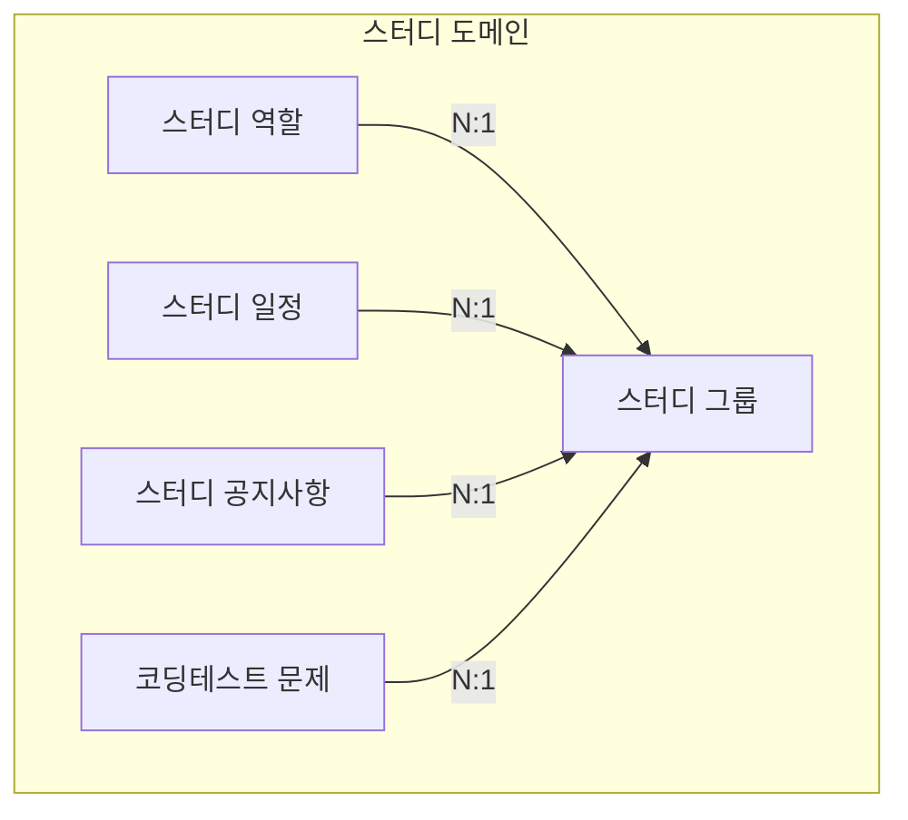
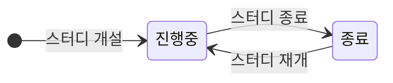
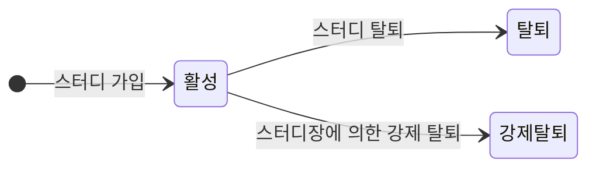
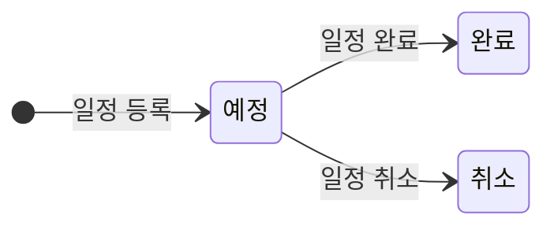
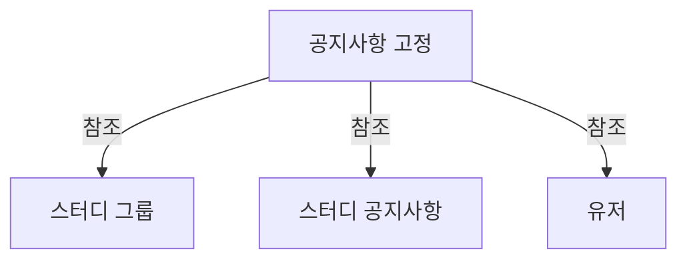
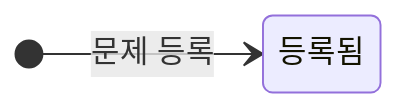
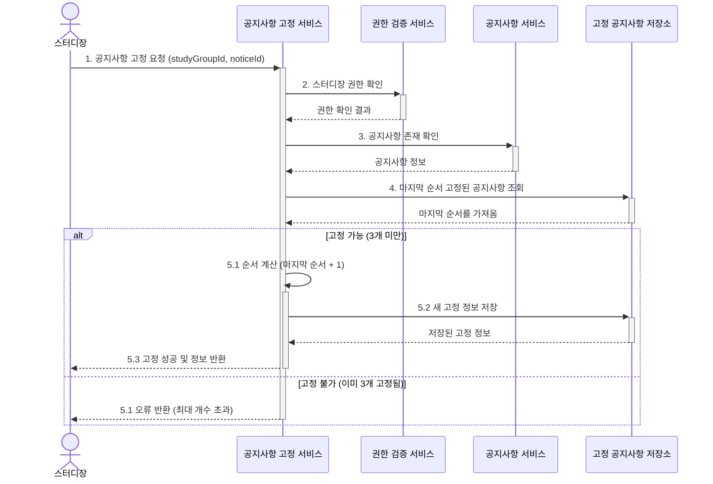
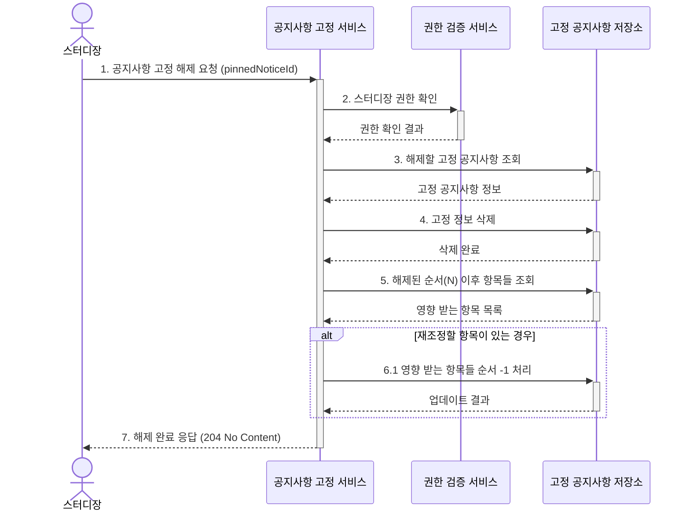

# Study 도메인 문서
Study(스터디) 도메인은 코딩테스트 스터디 서비스의 핵심 영역으로, 스터디의 생성부터 종료까지의 전체 생명주기와 관련된 모든 기능을 담당합니다. 이 도메인은 스터디 그룹, 멤버십, 일정, 공지사항, 문제 등 여러 세부 도메인으로 구성되어 있습니다.

## 도메인 구성요소
스터디 도메인은 다음과 같은 세부 도메인으로 구성됩니다:

## StudyGroup (스터디 그룹)

### 정의
StudyGroup은 Study 도메인의 핵심 구성요소로, 실제 스터디 모임의 인스턴스를 나타냅니다. 사용자들이 모여 코딩테스트 문제를 함께 풀이하고 공유하는 구체적인 활동 단위입니다.

### 상태

### 주요 속성

| 속성 | 타입 | 설명 |
|:---|:---|:---|
| id | String | 스터디 고유 식별자 |
| name | String | 스터디 설명 |
| description | String | 이메일 주소 - 고유값 |
| capacity | Integer | 최대 인원 |
| startDate | Date | 시작일 |
| endDate | Date | 종료일 (null 가능, 미정인 경우) |
| status | Enum | 스터디 상태 (진행중/종료) |
| languages | List<Enum> | 사용 프로그래밍 언어 목록 (Java, Python, C++ 등) |
| mainLanguage | Enum | 대표 프로그래밍 언어 |
| levels | List<Enum> | 풀이 대상 레벨 목록 (lv0, lv1, lv2, lv3, lv4) |
| platforms | List<Enum> | 문제 풀이 사이트 목록 (프로그래머스, 백준, 리트코드, 코드트리, 기타) |
| meetingType | Enum | 모임 방식 (온라인, 오프라인, 혼합) |
| region | String | 지역 (시/도, 시/군/구) |
| mainMeetingDays | List<Enum> | 대표 모임 요일 (월,화,수,목,금) |

### 주요 메서드 및 기능

- `createStudy()`: 새로운 스터디 그룹 생성 (진행중 상태로 시작)
- `updateStudyInfo()`: 스터디 기본 정보 수정
- `completeStudy()`: 진행중 상태에서 종료 상태로 전환 (스터디 진행 종료)
- `reopenStudy()`: 종료 상태에서 진행중 상태로 재개 (스터디장이 남아있는 경우에만 가능)
- `leaveStudy()`: 사용자의 스터디 탈퇴 처리 (스터디원이 직접 탈퇴하는 경우)
- `getMemberProgress()`: 특정 스터디원의 문제 풀이 진행률 계산 (개인별 현황 파악)
- `getStudiesByCondition()`: 조건에 맞는 스터디 검색

### 비즈니스 규칙

- 한 스터디는 반드시 한 명의 스터디장이 있어야 함
- 스터디는 하나 이상의 프로그래밍 언어와 대표 언어를 지정해야 함
- 스터디는 하나 이상의 문제 레벨을 선택해야 함
- 스터디는 하나 이상의 문제 풀이 플랫폼을 선택해야 함
- 종료일은 생성 시점에 설정하지 않아도 되며, 나중에 설정 가능함
- 종료된 스터디는 스터디장에 의해 재개될 수 있으며, 재개 시 기존 멤버십과 문제들이 유지됨 (단, 스터디장이 탈퇴한 경우에는 재개 불가)
- 스터디는 생성 시 바로 "진행중" 상태로 생성됨

### 참고사항

- region은 User 도메인과 동일하게 시/도 및 시/군/구 수준까지만 입력 받습니다. 현재는 단순 String으로 구현되어 있으며, 추후 행정구역 데이터를 기반으로 제한된 값만 입력 가능하도록 개선될 예정입니다.
- endDate는 null 값이 허용되며, 이는 종료일이 미정인 경우를 의미합니다. 스터디 진행 중에 종료일을 설정하거나 변경할 수 있습니다.
- mainLanguage는 반드시 languages 목록에 포함된 언어 중 하나여야 합니다. 이는 대표 언어가 스터디에서 실제 사용되는 언어임을 보장하기 위함입니다. mainLanguage는 다음과 같은 용도로 활용됩니다:
  - 스터디 목록에서 대표 이미지 표시 (언어별 로고 활용)
  - 스터디 검색 및 필터링 시 우선 기준으로 활용
  - 스터디 추천 알고리즘의 주요 매칭 요소로 사용
  - 플랫폼의 통계 데이터 생성 시 주요 분류 기준으로 활용
- levels는 플랫폼별로 다른 난이도 표기 방식을 통일하기 위한 자체 레벨 체계입니다. 구체적인 레벨 정의와 매핑 방식은 추후 결정될 예정입니다.
- languages는 프로그래밍 언어 목록을 Enum으로 관리하여 일관된 언어 표기와 선택을 보장합니다.

## StudyMembership (스터디 역할)

### 정의
사용자와 스터디 간의 관계 및 역할 정보를 관리하는 도메인입니다.

### 상태

### 주요 속성

| 속성 | 타입 | 설명 |
|------|------|------|
| id | Long | 멤버십 고유 식별자 |
| studyId | Long | 스터디 ID |
| userId | Long | 사용자 ID |
| role | Enum | 역할 (스터디장/스터디원) |
| joinedAt | LocalDateTime | 가입일시 |
| status | Enum | 상태 (활성/탈퇴/강제탈퇴) |

### 주요 메서드 및 기능

- `transferLeadership()`: 스터디장 권한을 다른 스터디원에게 양도
- `forceRemoveMember()`: 스터디원 강제 탈퇴 처리
- `getStudyMembers()`: 스터디의 모든 멤버 조회
- `getMemberRole()`: 특정 스터디에서 사용자의 역할 조회
- `getUserStudies()`: 사용자가 참여 중인 모든 스터디 조회

### 비즈니스 규칙

- 한 스터디에서의 역할은 하나만 가질 수 있음 (스터디장 또는 스터디원)
- 스터디장 권한 양도 시 이전 스터디장은 자동으로 스터디원이 됨
- 진행 중인 스터디에서 스터디장은 직접 탈퇴할 수 없으며, 다른 스터디원에게 권한을 양도한 후에만 탈퇴가 가능합니다
- 종료된 스터디에서는 스터디장도 직접 탈퇴 가능합니다
- 사용자는 여러 스터디에 동시에 참여 가능
- 스터디 상태(진행중/종료)와 관계없이 스터디원은 언제든지 탈퇴 가능

### 참고사항

- 스터디 종료 시에도 멤버십 정보는 유지됩니다.
- 스터디장이 탈퇴한 종료된 스터디는 재개할 수 없으며, 필요시 새로운 스터디로 개설해야 합니다.
- 스터디장 탈퇴 시 역할을 다른 멤버에게 자동으로 위임하는 기능과 스터디장 없이 종료된 스터디를 재개할 수 있는 기능은 추후 사용자 피드백에 따라 변경될 수 있습니다.

## StudySchedule (스터디 일정)

### 정의
스터디의 모임 일정을 관리하는 도메인입니다.

### 상태

### 주요 속성

| 속성 | 타입 | 설명 |
|------|------|------|
| title | String | 일정 제목 |
| description | String | 일정 설명 |
| location | String | 구체적인 모임 장소 (온라인 링크 또는 오프라인 상세 주소) |
| startTime | LocalTime | 시작 시간 |
| endTime | LocalTime | 종료 시간 |
| isRecurring | Boolean | 정기 일정 여부(현재는 항상 true) |
| recurrenceDays | List<Enum> | 반복 요일 (월,화,수,목,금) |
| startDate | LocalDate | 일정 시작일 |
| endDate | LocalDate | 일정 종료일 (null 가능) |
| createdBy | User | 작성자 |
| status | Enum | 상태 (예정/완료/취소) - 기본값 '예정' |

### 주요 메서드 및 기능

- `createSchedule()`: 요일 기반 스터디 일정 등록
- `updateSchedule()`: 일정 정보 수정
- `deleteSchedule()`: 일정 삭제
- `getSchedulesByPeriod()`: 기간별 일정 조회

### 비즈니스 규칙

- 일정은 스터디장과 스터디원 모두 등록 가능
- 일정 수정/삭제는 등록자 본인 또는 스터디장만 가능
- 스터디 일정은 반드시 제목, 시작 시간, 종료 시간, 요일 정보를 포함해야 함
- 시작 시간은 종료 시간보다 앞서야 함
- 시작일은 종료일보다 앞서야 함 (종료일이 null인 경우 제외)

### 참고사항

- 현재 버전에서는 요일 기반 정기 일정(월~금)만 지원합니다.
- 스터디 일정은 시작일(startDate)부터 종료일(endDate)까지 선택된 요일(recurrenceDays)에 정해진 시간(startTime~endTime)에 반복됩니다.
- 일정 조회 시 특정 일자에 해당하는 일정을 계산하여 제공합니다 (DB에는 패턴만 저장).
- 일정 조회는 기간별로 제공되며, 일정표나 캘린더 UI에 적합한 형태로 데이터를 반환합니다.
- 데이터 모델은 향후 일회성 일정을 지원할 수 있도록 설계되었으나, 현재 버전에서는 구현하지 않습니다.
- location 필드에는 온라인 모임의 경우 화상회의 링크, 오프라인 모임의 경우 상세 주소를 입력합니다.
- status 필드는 기본값 '예정(SCHEDULED)'으로 설정되며, 현재 버전에서는 상태 변경 기능을 제공하지 않습니다.
- 현재 버전에서는 일정 삭제 시 일정을 삭제합니다. 그래서 일정 전체가 삭제됩니다. 추후 버전에서는 일정을 상세히 하여 이전 일정을 보존하거나 특정 일정만 삭제할 수 있는 유연한 형태로 변경할 예정입니다.
- **중요:** 스터디 그룹의 mainMeetingDays와 개별 스터디 일정(StudySchedule)의 recurrenceDays는 별도로 관리됩니다. 두 설정 간의 자동 동기화는 제공되지 않습니다.

## StudyNotice (스터디 공지사항)

### 정의
스터디 내 공지사항을 관리하는 도메인입니다.

### 주요 속성

| 속성 | 타입 | 설명 |
|------|------|------|
| title | String | 제목 |
| content | String | 내용 |
| createdBy | User | 작성자 |

### 주요 메서드 및 기능

- `createNotice()`: 공지사항 작성
- `updateNotice()`: 공지사항 내용 수정
- `deleteNotice()`: 공지사항 삭제
- `getStudyNotices()`: 스터디의 모든 공지사항 조회
- `getPinnedNotices()`: 상단 고정된 공지사항 조회

### 비즈니스 규칙

- 공지사항 작성 권한은 기본적으로 스터디장에게만 있음
- 공지사항 수정은 작성자 본인만 가능 (작성자의 권한 보장)
- 공지사항 삭제는 작성자 본인과 스터디장이 가능 (스터디장은 관리 권한 보유)
- 종료된 스터디에서도 공지사항 작성, 수정, 삭제가 가능함 (소통 채널 유지)

## PinnedNotice (공지사항 고정)

### 정의

PinnedNotice(공지사항 고정)는 특정 스터디 그룹 내에서 공지사항을 상단에 고정하는 정보를 관리하는 독립적인 도메인입니다. 이 도메인은 공지사항과 스터디 그룹 사이의 관계를 나타냅니다

### 도메인 구성요소

### 주요 속성

| 속성     | 타입        | 설명                           |
|:-------|:----------|:-----------------------------|
| id     | String    | 고정 정보의 고유 식별자                |
| studyGroupId| String    | 스터디 그룹 ID                    |
|noticeId| String    | 고정된 공지사항 ID                  |
|pinnedAt| LocalDateTime| 고정 설정 시간                     |
|pinnedBy|String| 고정 설정한 사용자(스터디장) ID          |
|order|Integer| 고정 순서 (1부터 시작, 값이 작을수록 상단에 표시)|

### 비즈니스 규칙

1. **고정 개수 제한**
    - 한 스터디 그룹 내에서 최대 3개의 공지사항만 고정할 수 있습니다.
    - 이미 3개의 공지사항이 고정된 상태에서 새로운 공지사항을 고정하려면 기존 고정 중 하나를 먼저 해제해야 합니다.

2. **순서 관리**
    - 고정 순서는 1부터 시작하며, 값이 작을수록 더 상단에 표시됩니다.
    - 특정 순서에 새 공지사항이 고정되면, 해당 순서 이상의 기존 고정 공지사항들은 자동으로 한 단계씩 아래로 밀립니다.
    - 중간 순서의 공지사항이 고정 해제되면, 그보다 아래 순서의 공지사항들은 자동으로 한 단계씩 위로 당겨집니다.

3. **권한 제한**
    - 공지사항 고정 설정 및 해제는 스터디장만 가능합니다.
    - 스터디원은 고정된 공지사항을 조회할 수는 있지만, 고정 관련 작업은 수행할 수 없습니다.

4. **생명주기 의존성**
    - 공지사항이 삭제되면 관련된 고정 정보도 함께 삭제됩니다(CASCADE).
    - 스터디 그룹이 삭제되면 관련된 모든 고정 정보도 함께 삭제됩니다.

## Problem (코딩테스트 문제)

### 정의
스터디에서 풀이할 코딩테스트 문제를 관리하는 도메인입니다.

### 상태

### 주요 속성

| 속성 | 타입 | 설명 |
|------|------|------|
| title | String | 문제 제목 |
| url | String | 문제 링크 |
| description | String | 문제 설명 |
| memo | String | 추가 메모 (난이도, 분류 등 자유롭게 작성) |
| status | Enum | 상태 (등록됨) |
| createdBy | User | 등록자 |

### 주요 메서드 및 기능

- `registerProblem()`: 코딩테스트 문제 등록
- `updateProblem()`: 문제 정보 수정
- `getStudyProblems()`: 스터디의 문제 목록 조회
- `getSubmissionStatus()`: 문제별 스터디원 제출 현황 확인

### 비즈니스 규칙

- 문제는 기본적으로 스터디장만 등록 가능
- 풀이가 등록된 문제는 삭제할 수 없음
- 풀이가 등록된 문제도 url을 포함한 모든 정보를 수정할 수 있음

### 참고사항

- 문제 등록은 기본적으로 스터디장만 가능하지만, 스터디 설정에 따라 일반 스터디원에게도 권한을 부여할 수 있습니다.
- 현재 버전에서는 문제의 상태는 '등록됨' 하나만 존재합니다. 추후 버전에서는 다음과 같은 상태 관리 기능을 고려하고 있습니다:
    - '비공개' 상태: 스터디장만 볼 수 있는 준비 상태
    - '공개' 상태: 스터디원 모두에게 공개된 상태
    - '마감' 상태: 풀이 제출 기한이 지난 상태
    - 이러한 확장된 상태 관리를 통해 문제 출제 계획 수립과 스터디 일정 관리가 더 유연해질 수 있습니다.
- 난이도나 알고리즘 분류 등의 정형화된 정보는 제공하지 않고, 대신 자유롭게 작성할 수 있는 memo 필드를 통해 관련 정보를 남길 수 있습니다.
- 모든 문제는 등록 즉시 스터디원에게 공개됩니다.
- 풀이가 등록된 문제는 데이터 일관성 유지를 위해 삭제가 불가능하며, 해당 문제의 URL도 수정할 수 없습니다. 이는 기존 풀이와 문제 간의 연결이 깨지는 것을 방지하기 위함입니다.

### 도메인 간 시퀀스 다이어그램

#### 공지사항 고정 프로세스

### 공지항 고정 해지 프로세스

## 확장 고려사항

1. **성과 분석**
    - **문제 해결 패턴 분석:**
        - 사용자가 어떤 유형/난이도의 문제를 잘 해결하는지 분석
        - 문제 풀이 시간대 및 소요 시간 패턴 파악
        - 특정 알고리즘/자료구조 유형별 성공률과 취약점 시각화
    - 학습 진행도, 참여율 등의 지표 제공
    - **활용 이점:** 학습 효율성 향상, 맞춤형 학습 경로 제안, 약점 분야 집중 학습 가능

2. **스터디 추천 시스템**
    - **사용자 맞춤형 스터디 추천:**
        - 사용자의 관심사, 기술 수준, 학습 목표에 맞는 스터디 추천
        - 유사한 학습 패턴을 가진 사용자들의 스터디 추천
    - **문제 추천 기능:**
        - 사용자 수준에 맞는 다음 도전 문제 추천
        - 보완이 필요한 알고리즘/자료구조 관련 문제 추천
    - **활용 이점:** 사용자 맞춤형 학습 경험 제공, 플랫폼 참여도 향상, 학습 효율성 증대

3. **스터디 템플릿**
    - **특정 유형의 스터디 구성 템플릿화:**
        - 코딩 테스트 대비반, 기업별 면접 준비반, 알고리즘 집중반 등 목적별 템플릿
        - 단계별 학습 코스 (초급→중급→고급) 구성 템플릿
        - 특정 기술 스택 중심 템플릿 (Java 알고리즘, Python 데이터 구조 등)
    - 템플릿에 따라 기본 일정, 문제 유형 등이 자동 설정됨
    - 활용 이점: 스터디 구성 시간 절약, 검증된 학습 구성 활용, 초보 스터디장의 진입 장벽 낮춤

**참고:** 확장 고려사항은 구현 우선순위에 따라 정렬되었습니다.
