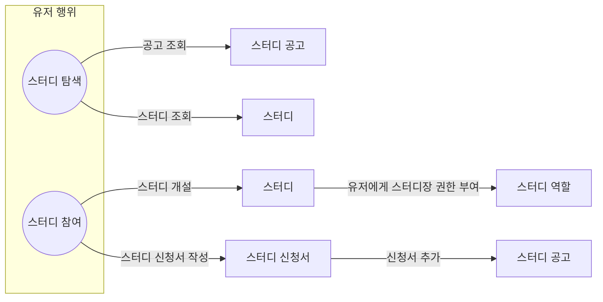
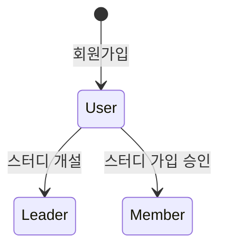

# 사용자(User) 역할

사용자는 코딩테스트 스터디 서비스의 기본 사용자 역할입니다. 스터디장이나 스터디원으로 참여하기 전의 상태입니다.

## 행위 및 도메인

## 도메인별 기능

- Study (스터디)
    - 조회
    - 생성

- StudyAnnouncement (스터디 공고)
    - 조회

- StudyApplication (스터디 신청서)
    - 작성
    - 제출

- StudyRole (스터디 역할)
    - 역할 부여

## 역할 상태

